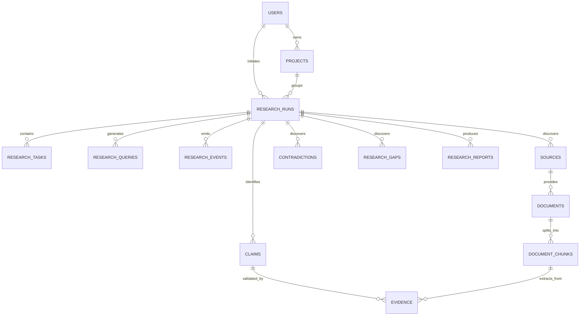

# ResearchOS — Database Architecture & Schema

ResearchOS utilizes PostgreSQL with the `pgvector` extension for storing relational metadata alongside dense vector embeddings.

---

## Entity-Relationship Overview

---

## Core Tables

1. **`users`**: User identity and account configurations.
2. **`projects`**: Contextual workspaces for organizing multiple research inquiries.
3. **`research_runs`**: Master research execution record, storing intent, depth, status, budget, and summary.
4. **`research_tasks`**: Decomposed subtasks generated by the Research Planner.
5. **`research_queries`**: Individual multi-strategy search queries issued across adapters.
6. **`sources`**: Normalized external references (academic papers, web pages, reddit posts, repositories).
7. **`documents`**: Ingested content with content hashes and metadata.
8. **`document_chunks`**: Structure-aware parsed chunks with page/section tracking and vector embeddings.
9. **`claims`**: Granular factual or methodological statements extracted from the corpus.
10. **`evidence`**: Direct evidentiary links connecting claims to exact chunk text, confidence, and page numbers.
11. **`contradictions`**: Documented disagreements and conflicting claims between sources.
12. **`research_gaps`**: Candidate underexplored areas, limitations, and future directions.
13. **`research_reports`**: Synthesized research briefs and reports with verified citations.
14. **`citations`**: Exact traceable mappings between report sections and source entities.
15. **`user_memory` & `research_memory`**: Contextual preferences, skillsets, and persistent project history.
16. **`llm_calls` & `tool_calls`**: Comprehensive telemetry for observability and audit trails.
